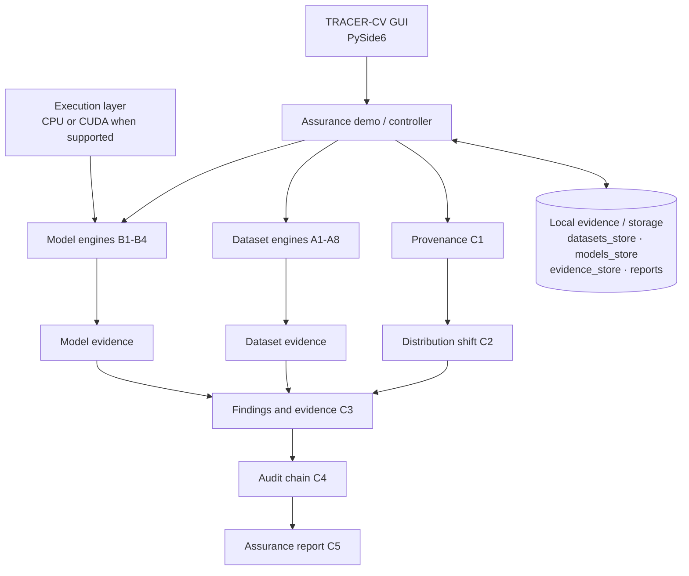

# TRACER-CV

**Trustworthy Computer Vision Integrity Assurance** is a local Python and PySide6 application for assessing image datasets, model identity and behavior, inference provenance, distribution shift, findings, audit evidence and an assurance report. Existing backend engines are the source of assessment evidence; the GUI is an analyst-oriented reader and launcher for those results.

> Current state: the desktop pages present the checked-in/demo engine evidence. Dataset folder selection is a UI affordance; running the toolbar assessment currently invokes the existing full demo pipeline against `demos/assets`. Model-specific UI actions also rerun that pipeline. Results that are unavailable or failed are not treated as completed. The project remains a work in progress and some adapter/test coverage is partial.

## 1. Project Overview

TRACER-CV targets integrity assurance for computer-vision training and inference workflows. It produces evidence and limitations, not a blanket safety verdict. The desktop application is local and does not need a cloud service, remote database, blockchain, or internet connection.

## 2. Problem Statement Alignment

The project maps to SIH problem statement SIH26228 as summarized below. Status refers to the code present in this repository, not a claim that every attack is detected reliably.

| SIH requirement | TRACER-CV implementation | Status |
|---|---|---|
| Training-data integrity | A1–A8 engines | Implemented for the methods listed below |
| Model integrity | B1–B4 engines | Implemented; format and loading limits apply |
| Inference provenance | C1 record and chain verification | Implemented |
| Distribution shift | C2 feature distribution comparison | Implemented |
| Analyst assurance | C3–C5 findings, audit and report | Implemented |
| Offline / air-gapped | Local files and desktop application | Implemented; no network required by these workflows |
| COCO / YOLO | Generic image folders plus separate label/contributor inputs; no complete COCO/YOLO adapter found | Partial / unavailable |
| ONNX / PyTorch / TorchScript | B1 hashes files without loading; TorchScript adapters exist; ONNX execution is not established by current demos | Partial |
| No-retraining baseline | Assessment workflows do not retrain models | Implemented |
| White-box fallback | Unsupported hooks/adapter paths report errors or unavailable status | Partial |
| Public / synthetic data | Synthetic demo assets in `demos/assets` | Implemented for demonstration |
| Reproducible audit log | C4 hash-linked local audit records | Implemented |
| Assurance report schema | C5 JSON and text output | Implemented |
| Coverage statement | Report limitations and `docs/COVERAGE.md` | Implemented |

## 3. Key Capabilities

- A1 manifest and Merkle dataset identity; A2 exact duplicates; A3 near duplicates.
- A4 reference/OOD comparison; A5 label consistency; A6 contributor/source risk; A7 metadata consistency; A8 poison/trigger-like forensic checks.
- B1 model SHA-256 identity; B2 behavioral fingerprint; B3 model statistics; B4 trigger search, subject to adapter support.
- C1 hash-linked inference records and optional Ed25519 signatures; C2 image feature shift; C3 evidence-oriented findings; C4 local audit chain; C5 report generation.
- PySide6 navigation, structured evidence tables/cards, image inspection for local project images, raw evidence dialogs, and in-memory provenance/audit tamper demonstrations.

## 4. Architecture



The data flow is: Input Dataset → dataset adapters/inputs → A1–A8 → dataset evidence; Input Model → model adapter → B1–B4 → model evidence; Inference Event → C1 → C2 → C3 → C4 → C5. `demos/run_full_assurance_demo.py` orchestrates the demo pipeline. Engine code lives under `backend/engines/`; the GUI loads local JSON evidence under `reports/`.

## 5. System Components

- `backend/engines/dataset`: A1–A8 dataset checks.
- `backend/engines/model`: model identity, behavioral fingerprint, statistics and trigger search.
- `backend/engines/provenance`: C1 and C4.
- `backend/engines/shift`: C2.
- `backend/engines/risk`: C3 and C5.
- `desktop`: PySide6 desktop UI.
- `demos`: local synthetic assets and runnable demos.
- `reports`: generated demo evidence and reports.

## 6. Dataset Integrity — A1–A8

A1 computes file identities and a dataset Merkle identity. A2 finds exact duplicate content. A3 compares near-duplicate candidates. A4 compares image populations with references. A5 checks labels. A6 examines contributor/source metadata. A7 examines acquisition metadata consistency. A8 searches for poison/trigger-like patterns. Methods and input shape are described in [coverage](docs/COVERAGE.md). Findings are candidates for review and do not prove intent.

## 7. Model Integrity — B1–B4

B1 streams a SHA-256 digest and heuristic format metadata without loading the model. B2 uses available model adapters to compute clean/probe outputs and behavioral summaries. B3 computes supported parameter/module/activation statistics. B4 performs configured trigger search; a zero-candidate result means no candidate met that search’s configured criteria, not proof of absence. TorchScript loading executes model code and therefore requires trusted input. Pickle-based checkpoint loading is unsafe for untrusted files.

## 8. Inference Provenance — C1

C1 binds input, model, preprocessing and output digests with a sequence, nonce, timestamp and previous-record hash. Verification checks the record hash and chain; Ed25519 signatures are optional and meaningful only when the public key is trusted. Demo evidence persists JSON-native record fields for verification. The GUI tamper action changes a deep-copied in-memory record only.

## 9. Distribution Shift — C2

C2 compares reference and candidate brightness, contrast, saturation, edge density and color/gray histograms, computes distances and reports anomalous candidate images. **Distribution shift does not by itself establish malicious manipulation.** Image-level outliers are statistical evidence, not malicious classifications.

## 10. Findings & Evidence — C3

C3 normalizes engine evidence into finding IDs, categories, severities, confidence, affected assets, explanations, recommended actions and limitations. Confidence is method-specific and not a calibrated probability unless an engine establishes that interpretation.

## 11. Tamper-Evident Audit Trail — C4

C4 creates sequence-checked, event-ID-checked chained hashes. It is local hash-chain evidence, not an externally anchored immutable log. The GUI tamper action changes an in-memory copy only.

## 12. Assurance Report — C5

C5 aggregates actual engine results, coverage, severity counts, limitations and verification state into JSON and text reports. C1 validity is derived by the C1 verifier when record dictionaries are present. C2 shift state is derived from its completed status, measured overall shift, severity and findings. Missing/unavailable evidence must remain unavailable.

## 13. Supported Dataset Formats

Current demo input is a directory of decodable images, with labels and contributor manifest as separate inputs. The engines are not a complete COCO or YOLO ingestion implementation. Malformed/unsupported inputs may be skipped or produce engine errors; consult each result’s `errors` and `limitations` fields.

## 14. Supported Model Formats

B1 can hash arbitrary files and infer likely format from extension/leading bytes; this is not full format validation. TorchScript adapters are present for supported B2/B3/B4 execution paths. ONNX and general PyTorch checkpoint execution are not established as safe/general-purpose capabilities. Do not load untrusted pickle-based `.pt`, `.pth`, `.ckpt`, `.pkl`, or `.joblib` files.

## 15. CPU/GPU Execution

Dataset and cryptographic engines are CPU-oriented. The GUI exposes Automatic, CPU and CUDA selection; Automatic performs a small local CUDA readiness probe and falls back to CPU if the runtime is unavailable or unsuitable. Explicit CUDA reports an error if unavailable. Device selection is passed to supported model adapters. This environment reports PyTorch 2.11.0+cu128 with CUDA unavailable, so CPU is the validated path; CUDA workload fallback after a later runtime failure is not universal.

## 16. Offline / Air-Gapped Operation

The documented desktop and demo use local files and make no remote API calls. No external service is required. Python packages must already be installed before an air-gapped deployment. The repository also contains an unused FastAPI backend entry point; launching the desktop does not launch a listener.

## 17. Security Architecture

The GUI reads local result JSON, uses local Qt resources and image rendering for project-contained images, and does not execute dataset files. B1 model identity does not load a model. C1/C4 demonstrations verify in-memory copies. The new asset registry rejects selected symlinks and oversized single files; recursive directory symlink and decoder resource controls remain incomplete. See [Security Model](docs/SECURITY_MODEL.md).

## 18. Threat Model

See [docs/THREAT_MODEL.md](docs/THREAT_MODEL.md) for assets, threats, trust boundaries and out-of-scope protections.

## 19. Trust Boundaries

The analyst workstation and installed Python environment are trusted. Imported datasets/models are untrusted. Assurance engines process inputs and produce local evidence. Reports and evidence remain mutable local files unless separately protected by system controls or trusted signatures.

## 20. Evidence and Cryptographic Integrity

SHA-256 establishes byte identity relative to a known digest. It does not establish safety. Merkle roots summarize dataset file digests. Ed25519 authenticates a record only when its public key is trusted. Chained hashes detect changes to a recorded sequence when the expected chain head is protected; a local attacker able to rewrite the full chain can recompute it.

## 21. Attack Coverage

See [docs/COVERAGE.md](docs/COVERAGE.md). Coverage indicates implemented checks, not guaranteed detection.

## 22. Unsupported Attack Classes

The project does not prove absence of adaptive/stealth poisoning, semantic backdoors, model exfiltration, runtime compromise, malicious dependencies, compromised trusted digests/keys, or all replay attacks outside recorded C1 sequence evidence. There is no universal scanner for arbitrary model code.

## 23. Limitations

Results depend on input quality, references, thresholds and adapters. Distribution and trigger-like evidence is statistical. Model hash equality is not a safety verdict. A missing finding does not prove an attack is absent. Some B3 executions currently return an error for the demo checkpoint. See each engine result’s limitations and [coverage](docs/COVERAGE.md).

## 24. Installation

Use Python 3.11+ and install the dependencies already specified/provisioned for the project environment. No dependency installation is required at runtime if using the provided `.venv`.

```bash
cd tracer-cv
source .venv/bin/activate
```

## 25. Configuration

The local configuration lives in `backend/core/local_config.py`, uses `configs/tracer_cv.toml` by default, and supports local storage paths, device, batch/workers limits, maximum file/image sizes, offline mode and logging level. Environment overrides use the `TRACER_CV_*` names described in [Deployment](docs/DEPLOYMENT.md). No secrets are required.

## 26. Running TRACER-CV

```bash
python -m desktop.app
```

Local diagnostics (with the project environment active):

```bash
./tracer-cv --offline-check
./tracer-cv --self-test
```

See [Offline Architecture](docs/OFFLINE_ARCHITECTURE.md), [Security Model](docs/SECURITY_MODEL.md) and [Deployment](docs/DEPLOYMENT.md) for deployment limits and verification scope.

## 27. Running the Demonstration

```bash
python demos/create_demo_assets.py
python demos/run_full_assurance_demo.py
```

The second command regenerates `reports/` demo outputs from assets under `demos/assets`.

## 28. Testing

```bash
pytest -q
```

The existing test files mix direct helper functions and pytest-discoverable tests. At the current repository state, a full pytest run reports passing checks plus fixture-setup errors for helper functions collected as tests. Run the tests listed in [reproducibility](docs/REPRODUCIBILITY.md) and interpret output accordingly.

## 29. Project Directory Structure

```text
tracer-cv/
├── backend/
│   ├── app/                 # Settings and FastAPI API (not launched by desktop)
│   ├── core/                # Hashing and Merkle utilities
│   └── engines/
│       ├── dataset/         # A1-A8
│       ├── model/           # B1-B4
│       ├── provenance/      # C1, C4
│       ├── risk/            # C3, C5
│       └── shift/           # C2
├── configs/
├── datasets_store/
├── models_store/
├── evidence_store/
├── desktop/                 # app.py and pages/widgets packages
│   └── resources/            # Offline Qt stylesheet
├── tracer-cv                # Checkout-local CLI launcher
├── demos/                   # assets, asset generator, demo runners
├── reports/                 # engine evidence, C4 chain and C5 reports
├── tests/
└── docs/
```

## 30. Reproducibility

See [docs/REPRODUCIBILITY.md](docs/REPRODUCIBILITY.md) for commands, environment notes and evidence locations. Generated timestamps/nonces may vary unless the demo supplies fixed values.

## 31. Example Workflow

Launch the GUI, review the Dashboard, open Dataset Integrity and inspect current A1–A8 output, investigate a listed local anomaly, review B1–B4 status, verify C1/C4, compare C2 features, inspect C3 findings and export the C5 JSON/text report. Run the full demo first when evidence is absent or stale. The demo currently uses its bundled inputs.

## 32. SIH Problem Statement Mapping

The table in section 2 is the implementation mapping. Dataset and model format adapters are partial as described there; unavailable methods should not be presented as implemented coverage.

## 33. Team / Project Information

Project branding: **TRACER-CV**. Desktop footer attribution: **Developed by Team DevZ**. Problem alignment: **SIH26228**.

## 34. License

No license file was present in the inspected repository. All rights and redistribution permissions are therefore unspecified; add the project’s approved license before external redistribution.
