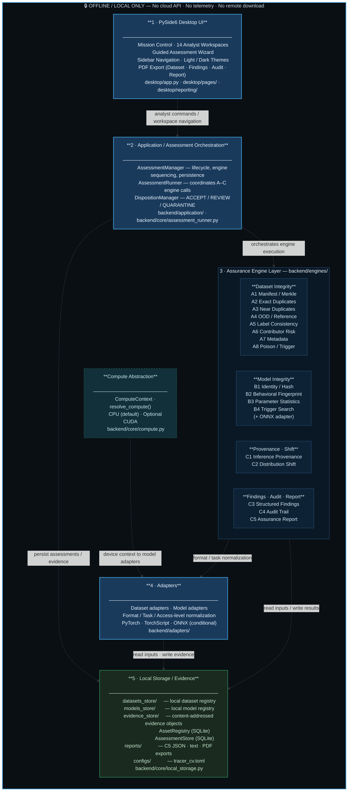

# TRACER-CV

**Trust, Reliability & Assurance for Computer Vision**

PS-26228

---

## Overview

TRACER-CV is an offline computer-vision integrity assurance platform that examines contributed datasets, supplied models, inference provenance, distribution shifts, and resulting evidence, then converts those observations into auditable analyst findings and assurance reports.

It is designed for air-gapped environments. All computation, storage, and reporting are local. No cloud services, telemetry, external APIs, or network connections are required or used during normal operation.

TRACER-CV **does not** produce a blanket safe/unsafe verdict. It reports structured evidence, identifies observations within each method's documented scope, and records limitations alongside every finding. Analysts review the evidence and record dispositions.

**Demonstrated scope:** image classification datasets and models. Dataset-level integrity checks operate independently of the model task.

---

## Core Workflow

```
Dataset  ──→  A1–A8  (dataset integrity checks)
                ↓
Model    ──→  B1–B4  (model integrity and behavior)
                ↓
Inference ──→  C1    (hash-bound provenance records)
                ↓
Distribution → C2    (reference/candidate shift analysis)
                ↓
              C3    (structured findings, evidence links)
                ↓
              Analyst disposition (ACCEPT / REVIEW / QUARANTINE)
                ↓
              C4    (local append-only audit trail)
                ↓
              C5    (assurance report: JSON, text, PDF)
```

Each stage is driven by local artifacts. Downstream stages consume only what upstream stages actually produced; unavailable engine results are preserved as `unavailable` or `partial` rather than fabricated.

---

## Architecture

TRACER-CV uses an adapter-based architecture in which assurance depth depends on the model format, task, adapter availability, and access mode.



**Layer responsibilities:**

- **Desktop UI** (`desktop/`) — PySide6 analyst workbench. Fourteen workspaces present engine results, findings, evidence, audit entries, and the assurance report. The sidebar, workspaces, and PDF renderer consume persisted assessment artifacts; they do not re-run engines.

- **Application / Orchestration** (`backend/application/`) — `AssessmentManager` coordinates the assessment lifecycle: planning, engine execution sequence, result persistence, and status transitions. `DispositionManager` records analyst ACCEPT / REVIEW / QUARANTINE decisions as separate audit-linked records without modifying C3 findings.

- **Compute Abstraction** (`backend/core/compute.py`) — `ComputeContext` / `resolve_compute()` resolves the active device (CPU default, optional CUDA). Device context is passed to model adapters; dataset and cryptographic engines are CPU-oriented.

- **Assurance Engines** (`backend/engines/`) — The A1–A8, B1–B4, C1–C5 engines are the authoritative source of assessment evidence. Each engine operates independently; a failed or unavailable engine result is preserved as `unavailable` or `partial` — it does not silently become success.

- **Adapters** (`backend/adapters/`) — Translate dataset and model inputs into the form each engine expects. Format compatibility, task scope, and access level (white-box vs. black-box) are determined at the adapter layer.

- **Local Storage** (`backend/core/local_storage.py`) — `AssetRegistry` (SQLite) records identity metadata for datasets and models. `EvidenceStore` persists content-addressed engine evidence objects. `AssessmentStore` (SQLite) persists assessment lifecycle records. `ReportStore` persists C5 JSON and text reports under `reports/assessments/<assessment_id>/`.

- **Offline boundary** — All computation, cryptographic operations, PDF generation, and storage are local. The CLI `--offline-check` flag statically scans source for network client imports. No cloud API, telemetry, remote model download, or blockchain network is used or required.

See [`docs/SYSTEM_ARCHITECTURE.md`](docs/SYSTEM_ARCHITECTURE.md) for the full layered architecture and incremental migration notes.

---

## Capability Groups

### Dataset Integrity — A1–A8

| Engine | Function |
|---|---|
| A1 | Manifest and cryptographic identity; optional Merkle tree over file digests |
| A2 | Exact duplicate detection by content digest |
| A3 | Appearance-based near-duplicate detection |
| A4 | Reference distribution / OOD-style appearance comparison |
| A5 | Label consistency checks for supported annotation formats |
| A6 | Contributor/source pattern analysis |
| A7 | Image metadata and acquisition consistency |
| A8 | Repeated localized trigger-like pattern forensics |

**Important limitations:**
- A4 compares appearance distributions; it does not establish semantic out-of-distribution status or intent.
- A6 contributor/source risk is heuristic and is not a maliciousness probability.
- A7 metadata anomalies do not prove tampering.
- A8 trigger-like candidates are investigation leads; they do not prove poisoning or a backdoor.
- A negative A8 search does not prove the absence of a backdoor.
- YOLO-style label validation is partial. COCO annotation handling is limited and does not constitute complete detection-model assurance. Segmentation assurance is not implemented.

### Model Integrity — B1–B4

| Engine | Function |
|---|---|
| B1 | Model file identity and cryptographic hash without executing the model |
| B2 | Deterministic behavioral fingerprint probe battery |
| B3 | Accessible parameter statistics and conditional activation analysis |
| B4 | Configured deterministic trigger-like behavior search |

**Important limitations:**
- B1 extension-derived format labels are hints, not validated format proofs.
- B2 behavioral differences do not independently establish malicious modification; legitimate differences can produce the same observations.
- B3 internal statistics require white-box access; unavailable in black-box mode. For ONNX, B3 reports initializer summaries — stored graph constants, not activation statistics.
- B4 is a deterministic configured search, not a universal unknown-trigger reconstruction. A negative B4 result does not prove the absence of a backdoor.
- TorchScript execution is not sandboxed and must be treated as trusted code.
- Pickle-based checkpoint formats (`.pt`, `.pth`) must not be loaded from untrusted sources.

### Inference Provenance — C1

C1 creates hash-bound provenance records that bind together:

- Input digest
- Model ID
- Preprocessing configuration digest
- Output digest
- Sequence number
- Nonce
- Timestamp
- Previous record hash
- Record hash
- Optional Ed25519 signature

Chain verification detects tampering, substitution, replay, and hash mismatches across a recorded inference sequence. Ed25519 signatures are optional and require trusted key handling outside TRACER-CV. Synthetic provenance demonstrations are included in `demos/`.

### Distribution Shift — C2

C2 compares a reference image population against a candidate population across:

- RGB histograms
- Grayscale distribution
- Brightness and contrast
- Saturation
- Edge density
- Image dimensions

It identifies per-image statistical outliers and reports features that cross configured shift thresholds.

> **The C2 overall shift magnitude is heuristic and is NOT probabilistically calibrated.** It is a measured distribution-deviation metric, not an attack probability. TRACER-CV has no validated calibration population or calibration curve.

### Findings — C3

C3 aggregates engine observations into structured findings. Each finding contains:

- Finding ID
- Category (dataset_integrity, model_integrity, provenance, distribution_shift)
- Severity (critical, high, medium, low, informational)
- Confidence
- Affected asset
- Explanation
- Evidence references
- Recommended action
- Limitations
- Source engine

Findings are evidence for analyst review — not attribution, not probability estimates, not verdicts.

### Analyst Dispositions

Analysts record dispositions against individual findings:

| Disposition | Meaning |
|---|---|
| ACCEPT | Observation reviewed and accepted as explained |
| REVIEW | Flagged for further review |
| QUARANTINE | Flagged as requiring isolation or escalation |

Dispositions are stored separately from C3 findings in `analyst_dispositions.json`. Each disposition creates a C4 audit event, binding the finding ID, old and new disposition, timestamp, and a digest of the source finding. The original C3 finding is never modified.

### Audit Trail — C4

C4 is a local tamper-evident append-only audit chain. Each entry records:

- Sequence number
- Event ID
- Timestamp
- Event type
- Source engine
- Affected asset
- Payload digest
- Previous entry hash
- Entry hash

The chain covers the full assessment lifecycle: asset registration, engine execution, verification, report generation, and analyst dispositions. No blockchain network is required. The chain is tamper-evident relative to a known trusted head; a sufficiently privileged local attacker who can rewrite all local files can recompute the chain.

### Assurance Report — C5

C5 produces a structured assurance report that includes:

- Assessment identity and scope
- Executive summary with severity counts
- Asset coverage (dataset, model, provenance, distribution, findings, audit)
- Dataset integrity section (A1–A8 results)
- Model integrity section (B1–B4 results)
- Inference provenance section
- Distribution shift section
- Findings and evidence
- Audit trail summary
- Recommended actions
- Limitations

**Export formats:** JSON, plain text, PDF.

PDF generation uses local Qt support. No internet connection is required for PDF export. PDF is a separate export artifact; generating or exporting it does not modify assessment evidence or the C4 chain.

---

## Professional PDF Reporting

PDF export was introduced and refined in Phase 17/18 and includes:

- Professional cover page with TRACER-CV identity and PS-26228
- Assessment Date (when the assessment ran) separated from PDF Export Date (when the file was written)
- Capability coverage table (A1–A8, B1–B4, C1–C5 status)
- Severity-colored finding blocks
- Distribution-shift calibration disclaimer
- Audit summary
- Limitations section
- Technical appendix

**Current PDF export locations:**

| Workspace | Export |
|---|---|
| Dataset Integrity | Export Dataset PDF |
| Findings | Export Findings PDF |
| Audit Trail | Export Audit Trail PDF |
| Report Center (C5) | Export Full Report PDF |
| Guided Assessment | Export PDF (summary) |

---

## Guided Assessment

A 9-step guided assessment wizard (`desktop/pages/guided_assessment.py`) walks an operator through:

1. Dataset selection
2. Model selection
3. Reference distribution selection
4. Assessment configuration
5. Provenance options
6. Distribution shift options
7. Engine selection
8. Review and confirmation
9. Results and export

The wizard delegates to the existing `AssessmentManager` and does not duplicate engine logic. Each step validates inputs before advancing. The visual step indicator shows current position. PDF export is available from the results step.

---

## ONNX Support

ONNX support is optional and conditional. The local CPU adapter targets:

- Single-input RGB image-classification graphs
- Rank-four image tensor input (`[N, 3, H, W]`)
- Rank-two output (`[N, num_classes]`)
- Embedded weights (no external data files)
- Standard opset operators

**Validated environment (Phase 18 real-file tests):**

```
onnx==1.23.1
onnxruntime==1.30.0
```

**What was validated with a real local `.onnx` file:**

- B1 identity and SHA-256 hashing of a real ONNX file
- Adapter loading and rejection of incompatible inputs
- Batch inference producing finite, reproducible output
- Deterministic inference across repeated calls
- B2 behavioral fingerprint on a real ONNX model

**Scope boundaries:**
- ONNX B3 reports initializer summaries (stored graph constants); activation statistics are unavailable through the current adapter.
- Arbitrary ONNX task compatibility is not established.
- ONNX Runtime native graph execution is not a general-purpose sandbox.
- The adapter does not execute embedded Python or register custom operators and rejects external weight data.

Optional ONNX dependency declarations:

```
# requirements-onnx.txt
onnx>=1.16,<2
onnxruntime>=1.18,<2
```

Provision matching packages from a locally approved wheelhouse before offline deployment. The application never installs dependencies at runtime.

---

## Desktop Application

TRACER-CV provides a PySide6 desktop analyst workbench. Current workspaces:

| Workspace | Purpose |
|---|---|
| Mission Control | Primary assessment dashboard — situation, findings, actions |
| Assessments | Assessment lifecycle management |
| Assets | Local dataset and model registry |
| Dataset Integrity | A1–A8 results with interactive sample inspection |
| Model Integrity | B1–B4 results with technical evidence drill-down |
| Inference Provenance | C1 chain display and verification |
| Distribution Shift | C2 population comparison and outlier analysis |
| Findings & Evidence | C3 findings browser with disposition workflow |
| Evidence Explorer | Cross-engine evidence search and inspection |
| Audit Trail | C4 chain browser with verification and PDF export |
| Reports | C5 assurance report with PDF export |
| Settings | Device selection, theme, and configuration |
| Coverage & Limitations | Per-capability coverage registry |
| Self-Test & Readiness | Local function verification |

**UI features:**
- Professional dark navy sidebar with semantic status colors
- Light and dark themes (toggle in application header)
- Semantic status colors: verified / review / critical / high / unavailable
- Responsive AnalystTable with word-wrapping and interactive column resize
- StatusCard widgets for at-a-glance engine status
- Guided 9-step assessment wizard
- PDF export from four workspaces

---

## Installation

**Requirements:** Python 3.11 or newer. Developed and tested with Python 3.14.7.

```bash
# Create and activate virtual environment
python3 -m venv .venv
source .venv/bin/activate

# Install core dependencies
pip install -r requirements.txt
```

**Optional ONNX inference support:**

```bash
pip install -r requirements-onnx.txt
```

Core dependencies include: PySide6 6.11.2, NumPy, Pillow, PyTorch, TorchVision, cryptography.

> **Offline/air-gapped deployment:** Resolve and verify all dependencies during connected staging, then transfer the wheelhouse to the isolated host. The application never downloads or installs packages at runtime. See [`docs/DEPLOYMENT.md`](docs/DEPLOYMENT.md) for the full provisioning procedure.

---

## Running

From the repository root, with the virtual environment active:

```bash
# Launch the desktop application
.venv/bin/python -m desktop.app
```

Or using the checkout-local launcher:

```bash
./tracer-cv
```

**CLI options:**

```bash
./tracer-cv --self-test        # verify local storage, resources, imports, and compute
./tracer-cv --offline-check    # static scan of source for network client patterns
./tracer-cv --device cpu       # override device selection (auto, cpu, cuda)
```

**Generate synthetic demo assets and run the full demonstration:**

```bash
.venv/bin/python demos/create_demo_assets.py
.venv/bin/python demos/run_full_assurance_demo.py
```

The demo uses bundled local assets from `demos/assets/` and writes reports to `reports/`. Review working-tree changes before preserving generated outputs.

---

## Reproducible Synthetic Benchmark

`demos/benchmark/` generates deterministic local synthetic scenarios using seed `26228`.

```bash
.venv/bin/python demos/benchmark/run_benchmark.py
```

**Current validated result: 17/17 synthetic scenarios detected.**

> All benchmark results are explicitly labeled **DEMONSTRATION DATA**. They are not operational assessment findings, benchmark accuracy estimates, or proof that any attack class is generally detected. Synthetic scenarios are constructed to exercise specific engine behaviors under controlled conditions only.

Scenario categories covered: dataset integrity (A2, A3, A4, A5, A7, A8), model integrity (B1, B4), and inference provenance (C1 — valid chain, invalid signature, output tampering, input substitution, model substitution, hash tampering, replay detection).

---

## Testing

```bash
.venv/bin/python -m pytest -q
.venv/bin/python -m compileall -q backend desktop demos tests
git diff --check
```

**Current verified test state: 422 passed, 0 warnings.**

Phase 18 added 65 new tests covering: professional PDF rendering, real ONNX file inference, workspace PDF exports, guided assessment wizard behavior, sidebar navigation layout, and UI component behavior.

Test coverage includes: A1–A8 engines, B1–B4 engines, C1–C5 functions, application orchestration, analyst disposition, audit trail, distribution shift, all major workspace pages, ONNX real-file validation, and PDF generation.

---

## Offline / Air-Gapped Operation

Normal TRACER-CV operation requires:

- No cloud API
- No telemetry
- No external authentication
- No CDN or remote fonts
- No remote model downloads
- No blockchain network
- No web server

All computation, storage, cryptographic operations, and PDF generation are local. The `--offline-check` CLI flag statically scans backend, desktop, and demo source for known network client imports. It cannot verify that OS-level networking is physically disabled; host network isolation remains an external deployment control.

---

## Project Structure

```text
backend/
  adapters/          Input mapping and format normalization
  application/       Assessment orchestration and lifecycle (AssessmentManager, DispositionManager)
  core/              Config, storage, compute, logging, capabilities, security
  db/                Local SQLite registry and schema
  engines/
    dataset/         A1–A8 dataset integrity engines
    model/           B1–B4 model integrity engines (includes onnx_adapter.py)
    provenance/      C1 inference provenance, C4 audit trail
    risk/            C3 findings, C5 assurance report
    shift/           C2 distribution shift
  security/          Path validation and input policy

desktop/
  app.py             Main window, routing, utility pages
  pages/             Analyst workspaces (one file per workspace)
  reporting/         PDF generation (report_pdf.py, write_section_pdf)
  resources/         QSS stylesheets (tracer.qss, tracer_dark.qss)
  widgets/           Shared components (NavigationSidebar, AnalystTable, StatusCard, ...)

configs/             Local application configuration (tracer_cv.toml)
datasets_store/      Local dataset storage and registry
models_store/        Local model storage
evidence_store/      Content-addressed evidence objects and asset registry (SQLite)
reports/             Persisted assessment results and report exports
tests/               422 offline unit and UI tests
demos/
  assets/            Bundled synthetic demo datasets and models
  benchmark/         Deterministic synthetic validation (17 scenarios, seed 26228)
docs/                Architecture, coverage, deployment, security, and reproducibility docs
```

---

## Supported Formats and Scope

### Model formats

| Format | B1 | B2 | B3 | B4 | Notes |
|---|---|---|---|---|---|
| PyTorch checkpoint (`.pt`, `.pth`) | ✓ | CONDITIONAL | CONDITIONAL | CONDITIONAL | Requires trusted source; pickle deserialization |
| TorchScript | ✓ | CONDITIONAL | CONDITIONAL | CONDITIONAL | Not sandboxed; must be trusted code |
| ONNX (`.onnx`) | ✓ | CONDITIONAL | PARTIAL | CONDITIONAL | CPU only; image-classification graphs; see ONNX section |
| Other / unrecognized | ✓ (hash only) | — | — | — | B1 hashes bytes regardless of format |

### Dataset formats

- Generic local image directories (PNG, JPEG, BMP, WebP)
- Reference/candidate image pairs for distribution comparison
- YOLO-style labels: partial validation
- COCO-style annotations: limited; not a complete detection-model assurance path
- Segmentation assurance: not implemented

---

## Security and Trust Model

TRACER-CV operates on these principles:

- Does not download models from external sources
- Does not execute arbitrary model code without explicit operator approval
- Does not contact cloud APIs
- Does not require telemetry
- Does not use a blockchain network
- Does not claim attacker attribution
- Does not produce security scores or safety ratings
- Does not convert heuristic measurements into calibrated probabilities

SHA-256 establishes byte identity relative to a known digest. It does not prove source authenticity or that an artifact is safe. C4 detects changes to the recorded chain relative to the chain head stored during assessment. Evidence, findings, and reports are local files subject to host access controls.

See [`docs/SECURITY_MODEL.md`](docs/SECURITY_MODEL.md) for the full trust boundary analysis.

---

## Coverage and Limitations

The coverage registry (`backend/core/capabilities.py`, also viewable under Coverage & Limitations in the desktop) documents each capability with one of:

| State | Meaning |
|---|---|
| SUPPORTED | Fully implemented within documented scope |
| CONDITIONAL | Depends on model format, access level, adapter, or configuration |
| PARTIAL | Partially implemented; documented boundaries apply |
| UNAVAILABLE | Not implemented for the current configuration |
| NOT_APPLICABLE | Outside the defined scope of this capability |

**Key limitations:**

- Trigger-like evidence is not proof of a backdoor or poisoning
- A negative B4 search does not prove absence of a backdoor
- C2 shift magnitude is heuristic and not probabilistically calibrated
- Contributor/source risk is heuristic, not maliciousness probability
- Metadata anomalies do not prove tampering
- Behavioral and parameter differences have legitimate possible causes
- Absence of findings does not prove absence of attacks
- Adaptive/semantic attacks, compromised runtime or hardware, malicious training infrastructure, key compromise, and attacks without observable evidence in supplied artifacts are outside or incompletely addressed by current methods

**Self-test / deployment readiness:** `READY` means required local TRACER-CV functions exercised by the self-test passed. It is not a security verdict for any assessed dataset or model, and it does not mean all optional capabilities are available.

See [`docs/COVERAGE_AND_READINESS.md`](docs/COVERAGE_AND_READINESS.md) and [`docs/PS26228_TRACEABILITY.md`](docs/PS26228_TRACEABILITY.md) for the full capability map.

---

## Reports

C5 is the authoritative persisted assurance report. The Report Center workspace presents its executive summary, asset coverage, findings, evidence links, and limitations. Local exports include JSON, plain text, and PDF generated using local Qt support.

PDF export is a separate artifact; generating or exporting it does not modify assessment evidence or the C4 chain. The PDF includes Assessment Date (when the assessment ran) and PDF Export Date (when the file was written) as distinct fields.

---

## Assurance Report Schema

C5 persists the authoritative machine-readable assurance report as a structured JSON file at:

```
reports/assessments/<assessment_id>/tracer_cv_assurance_report.json
```

The three export formats have distinct roles:

| Format | Role |
|---|---|
| **JSON** | Authoritative machine-readable persisted report; deterministically hashed (`report_digest`) |
| **Text** | Human-readable rendering of the same structured data; no independent digest |
| **PDF** | Presentation and export artifact; separate from the assessment evidence chain |

Generating or exporting a PDF does not modify the JSON report or the C4 audit chain.

### Top-level structure

The JSON report is a single object. All fields are produced by `backend/engines/risk/assurance_report.py`.

```
{
  "report_version":      string   — engine version (e.g. "c5-1.0")
  "method":              string   — "evidence-oriented assurance report"
  "task":                string   — "assurance_reporting"
  "assessment_id":       string   — bound assessment identifier

  "executive_summary":   object   — see below
  "asset_coverage":      object   — coverage state per assurance area
  "dataset_integrity":   object   — A1–A8 engine result wrapper
  "model_integrity":     object   — B1–B4 engine result wrapper
  "inference_provenance":object   — C1 engine result wrapper
  "distribution_shift":  object   — C2 engine result wrapper
  "findings_and_evidence":object  — C3 structured finding list
  "audit_trail":         object   — C4 chain verification summary
  "recommended_actions": array    — evidence-driven analyst actions
  "limitations":         array    — recorded method limitations

  "report_digest":       string   — SHA-256 of the report content (hex)
}
```

No formal JSON Schema file is included in this repository. The schema above reflects the actual fields produced by `build_assurance_report()` and present in all generated reports.

### `executive_summary`

```
{
  "assessment_scope":            string
  "finding_count":               integer
  "severity_counts":             { "critical": int, "high": int,
                                   "medium": int, "low": int, "none": int }
  "highest_observed_severity":   string   — "none" | "low" | "medium" | "high" | "critical"
  "provenance_chain_valid":      boolean | null
  "audit_chain_valid":           boolean | null
  "distribution_shift_detected": boolean | null
  "coverage":                    object   — mirror of asset_coverage
  "interpretation":              string   — fixed evidence-scope note
}
```

### `asset_coverage`

One entry per assurance area. Each entry has:

```
{
  "assessed":      boolean
  "status":        "available" | "not_assessed"
  "finding_count": integer   — present on findings_and_evidence only
}
```

Areas covered: `dataset_integrity`, `model_integrity`, `inference_provenance`,
`distribution_shift`, `findings_and_evidence`, `audit_trail`.

### `dataset_integrity` / `model_integrity`

```
{
  "status":        "assessed" | "not_assessed"
  "engine_result": object   — verbatim A1–A8 or B1–B4 engine output
  "message":       string   — present when not_assessed
}
```

### `inference_provenance`

```
{
  "status":        "assessed" | "not_assessed"
  "valid":         boolean | null   — C1 chain verification result
  "engine_result": object           — verbatim C1 engine output
}
```

### `distribution_shift`

```
{
  "status":          "assessed" | "not_assessed"
  "shift_detected":  boolean | null
  "severity":        string   — normalized severity of detected shift
  "engine_result":   object   — verbatim C2 engine output
}
```

### `findings_and_evidence`

```
{
  "count":           integer
  "severity_counts": { "critical": int, "high": int, "medium": int,
                       "low": int, "none": int }
  "highest_severity":string
  "findings":        array of finding objects (see below)
}
```

Each finding object:

```
{
  "finding_id":        string   — unique identifier (e.g. "C3-e98e4c50bfc1")
  "category":          string   — "dataset_integrity" | "model_integrity" |
                                  "provenance" | "distribution_shift"
  "severity":          string   — "none" | "low" | "medium" | "high" | "critical"
  "confidence":        string | null
  "affected_asset":    string   — path or identifier of affected artifact
  "title":             string
  "explanation":       string
  "evidence":          object   — source engine evidence references
  "recommended_action":string
  "limitations":       array
  "source_engine":     string   — engine code (e.g. "A2", "C2")
}
```

### `audit_trail`

```
{
  "status":        "assessed" | "not_assessed"
  "valid":         boolean
  "entry_count":   integer
  "finding_count": integer
  "verification":  object   — verbatim C4 chain verification result
}
```

### `recommended_actions`

Array of strings. Actions are evidence-driven and generated from observed finding severities and chain states. They are recommended analyst actions, not automated operational decisions.

### `limitations`

Array of strings. Includes seven default limitations from `backend/engines/risk/assurance_report.py` plus any engine-specific or assessment-specific additions. Limitations are recorded alongside findings and are present regardless of finding count.

### `report_digest`

SHA-256 hexadecimal digest of the report content, computed deterministically over the sorted-key canonical JSON serialization of all other fields. Used to detect post-generation modification of the persisted JSON file.

---

## Reproducibility

- Cryptographic identity: SHA-256 throughout; A1 optionally builds a Merkle tree over dataset file digests
- Deterministic benchmark: seed 26228; 17 reproducible synthetic scenarios
- Deterministic B2 probe batteries and B4 trigger search under fixed configuration
- C1 signed provenance with optional Ed25519 signatures
- C4 append-only local audit chain with chain-head verification
- Persisted assessment artifacts under `reports/assessments/<assessment_id>/`
- Dependency specification: `requirements.txt` (core), `requirements-onnx.txt` (ONNX)

See [`docs/REPRODUCIBILITY.md`](docs/REPRODUCIBILITY.md) for the full reproducibility notes.

---

## Documentation

| Document | Contents |
|---|---|
| [`docs/SYSTEM_ARCHITECTURE.md`](docs/SYSTEM_ARCHITECTURE.md) | Layered architecture, data flow, incremental migration |
| [`docs/COVERAGE_AND_READINESS.md`](docs/COVERAGE_AND_READINESS.md) | Capability states, limitations, self-test interpretation |
| [`docs/SECURITY_MODEL.md`](docs/SECURITY_MODEL.md) | Trust boundaries, model loading, audit integrity, network posture |
| [`docs/DEPLOYMENT.md`](docs/DEPLOYMENT.md) | Offline provisioning, configuration, local output paths |
| [`docs/REPRODUCIBILITY.md`](docs/REPRODUCIBILITY.md) | Demo workflow, engine sequence, verification commands |
| [`docs/PS26228_TRACEABILITY.md`](docs/PS26228_TRACEABILITY.md) | PS-26228 capability coverage map and boundaries |
| [`docs/EVIDENCE_MODEL.md`](docs/EVIDENCE_MODEL.md) | Evidence schema and storage architecture |
| [`docs/THREAT_MODEL.md`](docs/THREAT_MODEL.md) | Threat analysis and residual risks |

---

## License

Apache-2.0. See [`LICENSE`](LICENSE).

---

## Scope Summary

TRACER-CV uses an adapter-based architecture that separates assurance methods from specific model implementations. Supported assurance depth depends on model format, task, adapter availability, and access level. Current demonstrated scope centers on image classification, dataset-level computer-vision integrity, selected model formats (PyTorch, ONNX with documented constraints), and conditional black-box inference. COCO/YOLO ingestion does not constitute full detection-model assurance. Findings are evidence for analyst review — not attribution, not a universal security conclusion, and not a safety certification.
