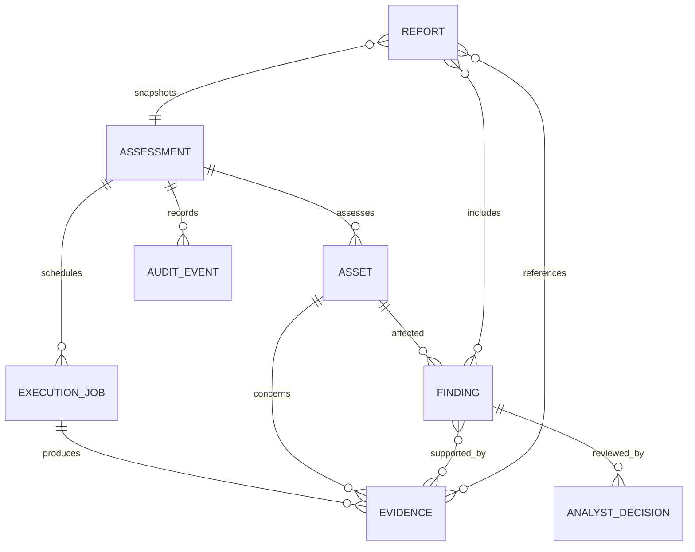

# TRACER-CV Target Data Model

This is a target domain model, not a claim that these typed objects or SQLite storage already exist. It wraps current engine inputs/results without changing algorithms. A serialized engine result remains available as immutable evidence. IDs should be UUIDv4 or another cryptographically random local identifier; content digests use SHA-256 over canonical JSON or raw bytes as appropriate.

## Core object relationships

Use stable IDs for relationships; do not duplicate large image/model bytes in relational rows. An assessment’s manifest records all chosen assets and engines, including inputs that were unavailable or skipped.

## Objects

### Assessment

- **Purpose:** One bounded assurance run and its reproducible scope.
- **Fields:** `assessment_id`; `title`; `created_at`; `started_at`; `completed_at`; `status` (`draft`, `queued`, `running`, `completed`, `partial`, `failed`, `cancelled`); `operator_id`; `purpose`; `asset_ids[]`; `requested_engines[]`; `configuration` (validated non-secret snapshot); `engine_coverage` map; `summary` reference/value; `previous_assessment_id` optional; `schema_version`.
- **Relationships:** Owns asset links, jobs, findings/evidence through jobs, audit events and report snapshots.
- **Lifecycle:** Draft → queued → running → completed/partial/failed/cancelled. A terminal assessment is not edited to change results; a rerun creates a new assessment optionally linked as a successor.
- **Persistence:** SQLite transactionally; persist scope and configuration snapshot before execution. Keep generated artifacts external and content-addressed.

### Asset

- **Purpose:** A dataset, model, annotation/manifest, inference input/output, preprocessing configuration, reference set, or other analyzed object.
- **Fields:** `asset_id`; `assessment_id`; `kind`; `display_name`; `canonical_local_uri` (relative to configured root where possible); `observed_path` (access-controlled); `format_hint`; `size_bytes`; `sha256`; `manifest_digest` optional; `trust_state` (`untrusted`, `trusted_for_hashing`, `trusted_for_execution`, `reference`); `validation_status`; `registered_at`; `metadata` allowlisted fields; `parent_asset_ids[]` optional; `schema_version`.
- **Relationships:** Belongs to an assessment; referenced by jobs, findings, evidence and reports. A model is a distinct asset from its model ID string in C1.
- **Lifecycle:** Discovered → validated/rejected → hashed → assessed/referenced. Asset identity is immutable; changed bytes create a new version/asset record.
- **Persistence:** SQLite metadata row; original bytes remain at source or are copied only under explicit policy. Store digest and safe relative location; never auto-execute an asset.

### Finding

- **Purpose:** An engine-authored observation requiring analyst interpretation or action.
- **Fields:** `finding_id`; `assessment_id`; `source_engine`; `engine_finding_id`; `category`; `severity`; `confidence` nullable numeric; `confidence_semantics`; `title`; `explanation`; `affected_asset_ids[]`; `evidence_ids[]`; `recommended_actions[]`; `limitations[]`; `observed_at`; `engine_version`; `payload_digest`; `schema_version`.
- **Relationships:** Produced during an execution job, references one or more evidence records and assets, and has zero or more analyst decisions.
- **Lifecycle:** Emitted → normalized for display → reviewed by decisions. Finding payload and engine severity/confidence are immutable. Retraction/correction is a linked superseding finding/event; analyst review does not mutate engine output.
- **Persistence:** SQLite index row plus canonical original payload in evidence storage. Preserve source engine values and normalization version.

### Evidence

- **Purpose:** Immutable traceable engine result, measurement, source artifact or verification outcome supporting assessment/finding conclusions.
- **Fields:** `evidence_id`; `assessment_id`; `execution_job_id`; `source_engine`; `engine_version`; `evidence_type`; `observed_at`; `asset_ids[]`; `payload_digest`; `digest_algorithm`; `serialization` (`canonical-json`, `raw-bytes`, etc.); `artifact_uri`; `size_bytes`; `method`; `limitations[]`; `parent_evidence_ids[]`; `sensitivity`; `schema_version`.
- **Relationships:** Produced by a job; references relevant assets; findings/reports link to evidence IDs. Evidence may support multiple findings.
- **Lifecycle:** Captured → validated/digested → persisted → referenced/exported → retained or explicitly expired under policy. Evidence is never silently overwritten.
- **Persistence:** Metadata row and content-addressed local artifact file. Write artifact atomically before committing a row referencing it. Verify the digest on read/export.

### ExecutionJob

- **Purpose:** One engine invocation or bounded orchestration step with independent status and runtime information.
- **Fields:** `job_id`; `assessment_id`; `engine_id` (`A1`…`C5` or adapter name); `status` (`queued`, `running`, `completed`, `partial`, `failed`, `cancelled`, `unavailable`); `input_asset_ids[]`; `output_evidence_ids[]`; `started_at`; `completed_at`; `progress` optional; `configuration_digest`; `resolved_device`; `worker_id` optional; `attempt`; `error_category`; `error_message` sanitized; `log_artifact_id` optional; `schema_version`.
- **Relationships:** Belongs to assessment; consumes assets/config; produces evidence; audit events record transitions.
- **Lifecycle:** Queued → running → terminal state. Retries create a new attempt/job record or linked attempt and never replace earlier output.
- **Persistence:** SQLite state transitions committed atomically; logs/artifacts stored locally. UI can recover queued/running jobs as interrupted after restart and mark them accordingly.

### AnalystDecision

- **Purpose:** Persist an analyst disposition separately from its immutable C3 finding and bind each change to local C4 audit evidence.
- **Fields:** `assessment_id`; `finding_id`; `old_disposition`; `disposition` (`ACCEPT`, `REVIEW`, `QUARANTINE`); `analyst_note`; UTC `timestamp`; SHA-256 `finding_digest`; `audit_event_id`; `audit_entry_hash`; `schema_version`.
- **Persistence:** `analyst_dispositions.json` beside the assessment result artifacts. It stores decision history and C4-shaped chained audit entries; the original C3 finding and `audit_chain.json` are not overwritten.
- **Invariants:** Every save appends a decision and audit event. The local chain is not an external trust anchor; analyst authentication/identity is not currently recorded.

### AuditEvent

- **Purpose:** Ordered local record of assessment, job, verification, decision, report and export actions.
- **Fields:** `event_id`; `assessment_id`; `sequence`; `timestamp`; `event_type`; `actor_id` optional; `source_component`; `target_type`; `target_id`; `payload_digest`; `previous_event_hash`; `event_hash`; `schema_version`.
- **Relationships:** Belongs to an assessment; points to related object identifiers. Uses C4 canonical hashing/chain verification through a compatible adapter.
- **Lifecycle:** Append → hash/link → verify. Never edit in place; a correction is a new linked event. Imported/legacy entries retain their source schema.
- **Persistence:** SQLite append transaction plus atomic durable chain-head state. Periodically export a signed/controlled checkpoint if a trustworthy external custodian exists; this remains an optional operational procedure, not a network dependency.

### Report

- **Purpose:** Reproducible C5 snapshot for analyst review, handoff and export.
- **Fields:** `report_id`; `assessment_id`; `created_at`; `created_by`; `report_version`; `status`; `included_asset_ids[]`; `included_finding_ids[]`; `included_evidence_ids[]`; `decision_ids[]`; `audit_head_hash`; `coverage`; `limitations[]`; `content_digest`; `json_artifact_uri`; `text_artifact_uri`; `export_history[]`; `schema_version`.
- **Relationships:** Snapshots an assessment and references its source assets, findings, evidence, decisions and audit head.
- **Lifecycle:** Draft snapshot → generated → verified → exported/reissued. Regeneration creates a new report version; it does not modify source evidence or an earlier report artifact.
- **Persistence:** SQLite metadata and immutable content-addressed JSON/text artifacts, written atomically. Revalidate referenced digests when rendering or exporting.

## State and integrity rules

1. Unknown or missing engine values remain `null`/`unavailable`; do not coerce to `false`, `0`, or a successful status.
2. Engine source payload, normalized display fields, and analyst decisions are separate records.
3. Timestamps are metadata and hash inputs where C1/C4 specify, not standalone integrity proof.
4. An asset byte change creates a new digest/version; reports bind exact evidence digests.
5. Database transactions and content-addressed artifact writes must avoid dangling references and silent replacement.
6. Schema migrations are versioned; retain the original JSON evidence for backwards compatibility and reproducibility.
