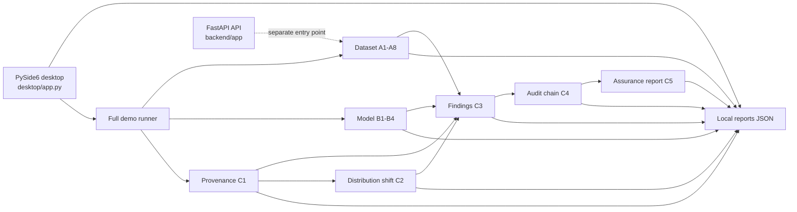

# TRACER-CV MVP Baseline Inventory

**Baseline date:** 2026-10-01  
**Scope:** Inventory only. This document records the repository after the initial analyst UI changes and before any further UI revamp. It is not a claim that every requirement is production-ready.

## Repository Inventory

Top-level project areas:

```text
backend/
  app/                 Pydantic settings and a FastAPI API
  core/                Hashing and Merkle helpers
  engines/
    dataset/            A1-A8
    model/              B1-B4
    provenance/         C1 and C4
    shift/              C2
    risk/               C3 and C5
desktop/                PySide6 app plus pages/widgets packages
demos/                  Synthetic asset creation and four demo runners
  assets/               Reference/candidate images, labels, manifest, model
reports/                Engine results, audit chain, JSON and text reports
tests/                  Engine/report tests and standalone test harnesses
docs/                   Coverage, threat model, reproducibility and PS-26228 traceability
frontend/               Present but empty; not used by the desktop application
configs/                Present, currently empty
datasets_store/         Present, currently empty
models_store/           Present, currently empty
evidence_store/         Present, currently empty
```

Notable files include `desktop/app.py`, `desktop/pages/dataset_integrity.py`, `backend/app/config.py`, `backend/app/api/datasets.py`, `demos/create_demo_assets.py`, `demos/run_full_assurance_demo.py`, and `backend/engines/risk/assurance_report.py`.

## Current Architecture



The desktop is local and PySide6 based. The active full assessment path is `demos/run_full_assurance_demo.py`, which imports/calls the engines directly, writes JSON evidence under `reports/`, and produces the C5 JSON/text report. `desktop/app.py` reads those generated files and displays them. The backend API is a separate FastAPI application (`backend/app/main.py`) and is not launched by `python -m desktop.app`.

## Working Modules and Current Behavior

| Area | Existing implementation | Baseline observation |
|---|---|---|
| A1 | `backend/engines/dataset/manifest.py`, `backend/core/merkle.py`, `backend/core/hashing.py` | Demo builds file hashes and Merkle identity; current run: 21 files |
| A2 | `dataset/duplicates.py` | Demo reports one exact-duplicate group |
| A3 | `dataset/near_duplicates.py` | Near-duplicate pair detection is included in the dataset pipeline |
| A4 | `dataset/ood.py` | Reference/candidate OOD assessment is included |
| A5 | `dataset/label_consistency.py` | YOLO-style text-label parsing and consistency checking; this is not full dataset-format ingestion |
| A6 | `dataset/contributor_risk.py` | Uses contributor manifest and emits risk evidence; current demo has one A6 finding |
| A7 | `dataset/metadata_consistency.py` | Metadata/acquisition consistency findings and summaries |
| A8 | `dataset/poison_trigger.py` | Forensic candidate search; current demo reports zero trigger candidates |
| B1 | `model/identity.py` | Streaming SHA-256 identity and heuristic format detection without loading model; tests cover digest behavior |
| B2 | `model/behavioral_fingerprint.py` | Probe-based fingerprinting through adapters; current demo status completed |
| B3 | `model/model_statistics.py` | Parameter/module and supported activation statistics; current full demo result is `error` for bundled checkpoint |
| B4 | `model/trigger_search.py` | Configurable trigger candidate search; current demo completed with zero candidates |
| C1 | `provenance/inference_provenance.py` | Canonical record hashes, chain/sequence/nonce checks, optional Ed25519 signatures; demo record verifies |
| C2 | `shift/distribution_shift.py` | Reference/candidate feature and histogram analysis, per-image candidate outliers; current demo completed |
| C3 | `risk/findings.py` | Normalizes evidence into findings, confidence, severity, actions and limitations; current demo: two findings |
| C4 | `provenance/audit_trail.py` | Local chained audit entries and verification; current demo: five entries, valid chain |
| C5 | `risk/assurance_report.py` | Builds JSON and text summary from engine results, findings, coverage and limitations |
| API | `backend/app/api/datasets.py` | A separate local-path scan route currently invokes A1 manifest and returns other checks as not assessed; not the full A1-A8 pipeline |

The full demo reports an error for B3; its B1/B2/B4 and other engine statuses must be read from generated result files. “Completed” is not a substitute for reviewing each engine’s limitations.

## Current Desktop UI

Navigation in `desktop/app.py` currently contains these eight pages:

1. Dashboard
2. Dataset Integrity
3. Model Integrity
4. Inference Provenance
5. Distribution Shift
6. Findings & Evidence
7. Audit Trail
8. Assurance Report

The pages use cards/tables, local report JSON, navigation, a raw-evidence dialog, C2 image inspection for project-contained files, finding filters and session review status, report export, and copy-only C1/C4 tamper actions. The selected directory is not yet wired into the full assessment flow: the Dataset page states that its assessment button runs the bundled demo. Some model-page actions also rerun that full demo rather than invoking a single engine. Demo execution is synchronous in the GUI thread.

### Raw evidence presentation locations

- `Page` adds **View Raw Evidence**, which opens a formatted JSON dialog for the current page’s result.
- C3 finding detail uses a JSON-formatted evidence dialog.
- C1/C4 are primarily rendered as tables and status summaries; raw evidence remains available from the same secondary action.
- `desktop/pages/dataset_integrity.py` is a separate legacy dataset page with its own tables and browse/scan controls. `desktop/app.py` does not currently add this class to its active page stack.
- `reports/tracer_cv_assurance_report.txt` is a text report, not a raw JSON view.

There are no active whole-page `QTextEdit` raw JSON screens in the current main-window stack. This should be rechecked if page wiring changes.

## Report and Evidence Storage

| Path | Contents / role |
|---|---|
| `reports/engine_results/dataset_integrity.json` | A1-A8 output |
| `reports/engine_results/model_assurance.json` | B1-B4 output |
| `reports/engine_results/provenance.json` | C1 record output, serialized as JSON-native fields by full demo |
| `reports/engine_results/distribution_shift.json` | C2 result including anomalous image records, summaries, distances and findings |
| `reports/engine_results/findings.json` | C3 finding list |
| `reports/evidence/audit_chain.json` | C4 serialized audit chain |
| `reports/tracer_cv_assurance_report.json` | C5 structured report |
| `reports/tracer_cv_assurance_report.txt` | C5 rendered text report |
| `reports/real_model_assurance_results.json`, `reports/real_engine_dataset_model_results.json`, `reports/b4_torch_demo.json` | Additional runner outputs |

These are local mutable files. Hash chains provide tamper evidence relative to a protected expectation; they do not make a local directory immutable. Re-running demos rewrites generated result paths.

## Current Execution Flow

1. `demos/create_demo_assets.py` creates deterministic local demo images, labels, a contributor manifest and model asset.
2. `demos/run_full_assurance_demo.py` runs A1-A8 on the bundled dataset and B1-B4 on the bundled model.
3. The runner creates C1 provenance, executes C2 reference/candidate image analysis, normalizes C3 findings, creates/verifies C4 audit entries and generates C5 JSON/text reports.
4. `desktop.app` loads the fixed local report paths. Its assessment controls invoke the full bundled demo, then reload visible page data.
5. Optional backend API launch is separate: `backend/app/main.py` serves health and dataset scan routes if explicitly run with an ASGI server. It is not part of the desktop launch command.

## Baseline Test and Demo Results

Environment observed: project `.venv`, Python 3.14.7, PySide6 6.11.2, PyTorch 2.11.0+cu128; `torch.cuda.is_available()` was false in this environment.

### Pytest

Command:

```bash
.venv/bin/pytest -q
```

Result on 2026-10-01: **114 passed, 16 errors, 6 warnings**. The 16 errors are pytest fixture-setup errors: standalone test harness functions in `tests/test_assurance_report.py`, `tests/test_audit_trail.py`, and `tests/test_inference_provenance.py` are named `test_*` and accept arguments such as `report`, `entries`, or `record` without pytest fixtures. Warnings include helper test functions returning constructed values. The remaining discovered tests passed. This test organization issue exists at baseline and is not recorded as a backend-engine failure.

### Full assurance demo

Command:

```bash
.venv/bin/python demos/run_full_assurance_demo.py
```

Result: exit code 0; runner reached `FULL ASSURANCE RUN COMPLETE` and wrote C1-C5 and engine outputs. Per-run evidence summary:

- A1: 21 files; A2: one exact duplicate group; A5: zero findings; A6: one finding; A8: zero trigger candidates.
- B1, B2 and B4 completed; B3 returned `error`; B4 candidate count was zero.
- C1 completed; C2 completed; C3 produced two findings; C4 completed with five entries; C5 JSON and text files were generated.

The GUI was not used as a substitute for the backend demo in this baseline. Pytest and the full assurance demo are the commands actually run for this record.

## Known Limitations

- Full COCO ingestion and general ONNX inference are not established. A5 parses its supported YOLO-style label text but is not a complete YOLO dataset adapter.
- B1 identifies bytes and heuristic format metadata; it does not certify model safety. Pickle-based checkpoint loading is unsafe for untrusted files. TorchScript execution requires trust.
- B3 fails for the bundled model in the full demo. CUDA was unavailable; no GPU behavior was validated.
- Risk confidence values are method outputs, not shown to be statistically calibrated.
- Distribution shift and trigger-like findings do not prove malicious manipulation or backdoors.
- The selected Dataset directory is not connected to the full A1-A8 runner in the current main UI. Page controls invoke the fixed demo dataset.
- Model-page controls rerun the full pipeline instead of selecting an individual B engine. GUI work runs synchronously and may block interaction during the demo.
- Review status is session-local and not persisted as separate analyst workflow evidence.
- The report/evidence output path is fixed to repository `reports/` for demo runs; atomic writes and append-only preservation are not consistently implemented by all runners.
- `backend/app/api/datasets.py` resolves an arbitrary requested local path and lacks configured-root containment checks. Do not expose this API to untrusted clients.
- Central UI configuration for device, workers, batch size, maximum file/image sizes, and logging is not implemented.

## Known Technical Debt

- Pytest collection mixes real assertions with standalone harness helpers, causing fixture errors and warnings.
- Several demo outputs use fixed paths; repeated runs overwrite previous generated evidence.
- Engine result schemas are heterogeneous and the UI contains per-page extraction logic rather than a shared typed result model.
- Main UI and legacy `DatasetIntegrityPage` have overlapping responsibilities; only the main-window page is wired.
- The current Dataset assessment button reports that it uses bundled demo assets; arbitrary selected dataset execution is still a separate integration task.
- No full GUI automation or accessibility/interaction suite is present in the repository.
- No dependency lock file or packaging manifest was found in the inspected top-level files.

## Files That Should Not Be Unnecessarily Rewritten

Preserve existing algorithms, thresholds, data structures and test evidence unless a specific bug is demonstrated:

- `backend/engines/dataset/*.py` (A1-A8)
- `backend/engines/model/*.py` (B1-B4)
- `backend/engines/provenance/inference_provenance.py` (C1)
- `backend/engines/shift/distribution_shift.py` (C2)
- `backend/engines/risk/findings.py` (C3)
- `backend/engines/provenance/audit_trail.py` (C4)
- `backend/engines/risk/assurance_report.py` (C5)
- `backend/core/hashing.py`, `backend/core/merkle.py`
- `tests/` and `demos/` input assets; change these only to correct a verified issue or make the baseline runner reproducible.

For a UI revamp, prefer `desktop/app.py`, reusable desktop widgets/pages and explicit result adapters. Keep changes to engines narrow, evidence-backed and covered by their existing checks.
