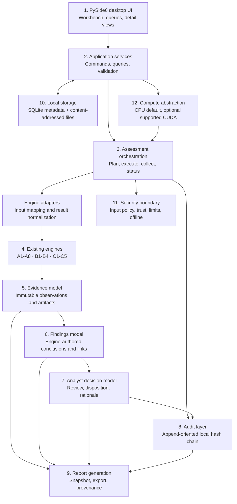

# TRACER-CV Target System Architecture

**Product:** TRACER-CV — Computer Vision Integrity Assurance Workbench  
**Audience:** intelligence, security and defence analysts  
**Operating model:** local desktop, offline and air-gapped  
**Purpose:** target design for the MVP revamp. This document does not claim the architecture is already implemented.

## Design goals

The workbench should make existing assurance output understandable and reviewable while preserving the existing engines as the source of detection results. It must show scope, observations, reasons, supporting evidence, affected assets, investigative next steps, limitations and technical detail. A UI or orchestration layer must not adjust engine thresholds, infer absent findings, or silently convert unavailable evidence into a successful assessment.

## Layered architecture



### 1. Desktop UI

Keep PySide6. Preserve the existing navigation categories: Dashboard, Dataset Integrity, Model Integrity, Inference Provenance, Distribution Shift, Findings & Evidence, Audit Trail and Assurance Report. Pages query application services and submit commands; they do not import engine modules directly. Every summary links to its source finding/evidence and labels unavailable or failed work distinctly. Technical JSON remains a secondary view.

### 2. Application/service layer

Owns UI-facing use cases: create assessment, register/select assets, run checks, cancel or inspect jobs, verify chains, record analyst decisions, and generate/export reports. Services enforce state transitions and access policy. They return typed view models and references, not raw Python engine objects. The current `desktop/app.py` directly loads fixed report JSON and invokes the full demo; the service boundary replaces this coupling incrementally.

### 3. Assessment orchestration layer

Builds an explicit plan from chosen assets and requested engines. Runs the corresponding existing engines through narrow adapters, tracks `ExecutionJob` state/progress, captures logs and errors locally, and persists each engine result before downstream aggregation. A failed B3 must not invalidate completed B1/B2/C checks. C3/C5 consume only actual available results, retaining `not_assessed`, `unavailable`, `error` and `partial` states. Orchestration coordinates engines; it does not reproduce their detection algorithms.

### 4. Existing assurance engines

Preserve `backend/engines/dataset/` A1–A8, `model/` B1–B4, `provenance/inference_provenance.py` C1, `shift/distribution_shift.py` C2, `risk/findings.py` C3, `provenance/audit_trail.py` C4 and `risk/assurance_report.py` C5. Adapters translate inputs and normalize outputs, retaining the original result payload and engine version/digest for technical review.

### 5. Evidence model

Every engine observation is represented as immutable evidence with source engine/version, assessment/job, affected asset, method, timestamp, canonical payload digest, limitations and optional artifact reference. Store original engine output bytes or a canonical JSON serialization as a content-addressed artifact. See [EVIDENCE_MODEL.md](EVIDENCE_MODEL.md).

### 6. Findings model

Findings retain engine-authored IDs, category, severity, confidence, explanation, evidence references, affected assets, recommended actions and limitations. UI-friendly normalization may add display labels, but may not change severity/confidence or imply calibrated probability. Finding content is immutable; review state belongs to the AnalystDecision aggregate.

### 7. Analyst decision model

Analyst decisions record a reviewer identity or local pseudonymous operator ID, action, rationale, timestamp, target finding, optional disposition and superseded decision reference. Allowed actions include acknowledge, request further investigation, mark reviewed, escalate and close with rationale. Decisions are separate from engine findings and append-only; correcting a decision creates a new event that supersedes the earlier one.

### 8. Audit layer

Record assessment lifecycle, asset registration, engine execution, verification, report generation/export and analyst decisions as ordered audit events. Use existing C4 canonical hashing and verification where its event schema fits; add only a storage adapter if required. Audit writes are append-oriented and atomic. Persist the latest chain head separately and include it in backups/reports. A local hash chain is tamper-evident relative to a trusted head, not immutable against an attacker who can rewrite all local state.

### 9. Report generation

Use C5 to build an evidence-oriented report snapshot. Reports include assessment scope and status, assets, engine coverage, findings/counts, decisions/dispositions, linked evidence digests, chain verification result and explicit limitations. Export JSON and text first; any future format must preserve the same source links and digest manifest. Generating/exporting a report must not mutate source evidence.

### 10. Local storage

Target: SQLite for indexed metadata/state and a local content-addressed evidence/artifact directory for larger bytes. Keep paths under configured application storage roots. Use atomic file replacement, SQLite transactions, schema migrations, backup/restore, and explicit retention policy. Existing `reports/engine_results/*.json`, `reports/evidence/audit_chain.json`, C5 JSON/text and demo outputs remain readable as legacy/import-export evidence during migration. Do not silently overwrite imported evidence.

### 11. Security layer

Validate paths, formats, symlinks, file sizes, image dimensions and annotation inputs before engine use. Treat imported assets as untrusted. Do not execute scripts from datasets or dynamically import user files. B1 remains hash-only. Model execution is gated by explicit trusted-execution policy; unsafe pickle loading is prohibited for untrusted checkpoints. Keep private keys outside reports/evidence and expose only public verification material as policy permits. No network clients, telemetry, cloud dependencies or listeners are part of the desktop architecture.

### 12. Compute abstraction

Provide a local `ComputeContext` with requested mode (`auto`, `cpu`, `cuda`), resolved device, runtime information and safe fallback status. CPU is always supported and is the default for CPU-oriented A/C engines. Pass device context only into model adapters that already accept/benefit from it. CUDA availability or failure must not be represented as successful CUDA execution when the engine actually used CPU. Existing adapters do not yet share one device interface; this is an integration boundary, not a new detection algorithm.

## Data flow

```text
Dataset/model/inference inputs
  → validated Asset references
  → Assessment plan and ExecutionJobs
  → existing A1-A8 / B1-B4 / C1-C2 engine calls
  → immutable Evidence records
  → C3 Findings linked to evidence and assets
  → C4 AuditEvents for execution and analyst actions
  → C5 report snapshot and local exports
```

Existing dependencies remain meaningful: A/B/C1/C2 results feed C3; events are recorded by C4; C5 aggregates actual evidence, coverage and limitations. If a required engine output is absent or malformed, downstream output indicates unavailable/partial and retains the error rather than fabricating a value.

## Incremental migration

1. Add typed domain objects and storage behind existing JSON result files; do not change detection algorithms.
2. Wrap current demo/engine calls in adapters and compare normalized values to existing outputs.
3. Add application services and page view models; keep current navigation and secondary raw-evidence access.
4. Add analyst decision and audit persistence as additive data.
5. Migrate reports through C5 snapshots, preserving legacy exports and evidence digests.

Each step should be reviewable against the [baseline](MVP_BASELINE.md) and [SIH traceability](SIH26228_TRACEABILITY.md).
