# TRACER-CV Workbench UX Design

**Product name:** TRACER-CV — Computer Vision Integrity Assurance Workbench  
**Primary user:** professional intelligence, security and defence analyst  
**Platform:** local PySide6 desktop, offline/air-gapped  
**Status:** design specification only; it does not claim the complete target UX is implemented.

## Analyst needs

Every page should answer, in this order:

1. **What was assessed?** Exact dataset/model/inference assets, digest/identity, references, scope and time.
2. **What was observed?** Measured result, count, status and relevant threshold.
3. **Why was it flagged?** Plain-language explanation tied to a specific engine result.
4. **What supports the finding?** Evidence values, source engine/version, image/sample and digest.
5. **What is affected?** Dataset, model, inference record, contributor or sample identifiers.
6. **What should happen next?** Engine recommendation, analyst choice and rationale kept separately.
7. **What is unknown?** Unsupported input/method, errors, limitations, reference assumptions and confidence semantics.
8. **What technical details are available?** Original payload, hashes, parameters, record chain and exportable evidence.

The UI must distinguish observation from interpretation and analyst decision. A high severity is triage priority, not a calibrated attack probability. “No finding” is not equivalent to “safe.”

## Information architecture

Keep the established left navigation and add shared application-level assessment context:

- **Header:** TRACER-CV branding, assessment ID/name, saved/unsaved state, active local compute device, Offline/Air-Gapped indicator.
- **Assessment selector:** current/recent local assessments, create assessment and explicit source asset list.
- **Navigation:** Dashboard; Dataset Integrity; Model Integrity; Inference Provenance; Distribution Shift; Findings & Evidence; Audit Trail; Assurance Report.
- **Workspace:** page title, scope/status, primary visual evidence, filters/drill-down, technical evidence action.
- **Footer/status:** job progress, warnings/errors, local storage state and no-network operating mode.

Use consistent status words and icons with text labels: `Completed`, `Partial`, `Review`, `Failed`, `Unavailable`, `Not assessed`, `Running`, `Cancelled`. Never use green/checkmark alone where the status is partial or refers only to execution completion.

## Assessment overview and workflow

```mermaid
flowchart LR
  S[Select/create assessment] --> A[Register and validate assets]
  A --> P[Review assessment plan]
  P --> R[Run checks and monitor jobs]
  R --> F[Review findings and evidence]
  F --> D[Record analyst decisions]
  D --> V[Verify provenance and audit]
  V --> Q[Generate report snapshot]
  Q --> X[Review and export local package]
```

An analyst may open prior results without rerunning engines. Rerun is a deliberate action that creates a new assessment or attempt and must name the changed asset/configuration. The UI must show per-engine progress and permit cancellation where safe; it must not simulate progress when no job is running.

## Page-level design

### Dashboard

- Assessment identity, creation/completion time, selected assets and overall coverage.
- Cards for A1–A8, B1–B4, C1–C5 with actual status and click-through.
- Severity totals from actual C3 findings; distinguish critical/high/medium/low/none and unavailable findings.
- Short assessment pipeline with each stage’s job status, duration and evidence count.
- **Run assessment** opens an explicit plan/scope confirmation page, then starts actual configured engine jobs.
- Surface top findings by severity and review state; do not label an assessment “clean” unless a product-approved, evidence-based definition exists.

### Dataset Integrity

- Dataset/reference/label/manifest asset paths and digests, formats and validation state.
- A1–A8 checklist with completed/partial/error/unavailable per check.
- Summary cards derive counts from A engine outputs; each card links to the corresponding rows and original evidence.
- Image-level evidence table: thumbnail, path/ID, engine, reason, severity scope, measured score/value, affected labels/contributor and review state.
- Inspect opens a bounded local preview and full evidence context: raw measurements/units, z-score definition, source result, actual severity provenance, limitations and linked assets.
- Actions update analyst decision records; no “malicious” toggle.

### Model Integrity

- Asset display name, format confidence, SHA-256, expected digest source/comparison, size and trust/execution access level.
- Four engine cards: B1 identity; B2 behavioral fingerprint; B3 parameter/activation statistics; B4 trigger search.
- Behavioral views include clean response, probe names, confidence/entropy when available, class distribution and deviations from an identified baseline.
- B3 separates parameter, buffer, module and activation coverage; unsupported hooks show `Unavailable` with the actual reason.
- B4 shows configured patch sizes/positions/classes, candidate count, metrics and threshold definitions. Zero candidates is not “no backdoor.”
- Model execution requires a trusted-model confirmation or approved local policy. B1 hash inspection remains non-executing.

### Inference Provenance

- Graph: input digest → model identity → preprocessing digest → output digest.
- Record table: sequence, nonce, timestamp, previous/current hash, signature checked/state and C1 verifier result.
- Explicitly distinguish hash-valid, chain-valid, signature-not-checked and signature-invalid.
- Tamper demonstration acts only on a copied in-memory record, clearly labels the copy, shows changed field and verifier output, and has a restore/discard action. It never rewrites evidence.

### Distribution Shift

- Reference and candidate identity/count/error totals plus overall shift, severity and thresholds from C2.
- Feature comparison with reference mean, candidate mean, distance, threshold, unit and shifted flag.
- Candidate anomaly table with max reference-relative z-score and per-feature values; linked image detail.
- Show the statement: “Distribution shift does not by itself establish malicious manipulation.”
- If C2 lacks a histogram or feature distribution needed for a chart, show the available scalar/table evidence and state the unavailable view instead of synthesizing data.

### Findings & Evidence

- Search and apply severity/category/asset/source-engine/status/review-state filters.
- Finding cards/rows show finding ID, source engine, category, severity, confidence plus semantics, affected assets, title and review state.
- Detail view expands explanation, evidence references/values, recommended action, limitations and technical source payload.
- Analyst actions require optional/required rationale according to action; decisions are locally persisted and audited. The engine finding remains unchanged.

### Audit Trail

- Current chain status and verification time, ordered timeline/table with sequence, event ID, actor/source, target, timestamp, payload digest, previous and current hashes.
- Event detail shows canonical fields and verifier output.
- Tamper simulation verifies an in-memory copy and explicitly labels it as a demonstration. Audit entries are never edited to demonstrate a failure.

### Assurance Report

- Assessment scope, asset coverage, engine statuses, provenance/audit verification, finding severity and analyst decisions.
- Summary cards link to the underlying finding/evidence and clearly call out partial/unavailable areas.
- Generate creates a new immutable report snapshot; JSON/text exports use a preview that lists included evidence and digests.
- Open Evidence and Open Audit Trail navigate to source records.

## Interaction and display rules

- Tables support sorting, selection, copy of visible values, keyboard navigation and contextual **Inspect**.
- Filters apply explicitly and show active filter count plus result count; reset is available.
- Long operations run off the GUI thread with a bounded worker pool and signal-driven progress/status. The UI remains responsive.
- Errors show a short analyst message and expandable technical details. Sensitive path fragments/secrets are not copied into routine logs.
- Tooltips define metric units and confidence/severity meaning. Charts include labels, scales and accessible tabular equivalents.
- Use high-contrast status colors, text/icon redundancies, scalable fonts, non-color status cues and screen-reader names for controls.
- Preserve complete raw evidence as secondary technical detail. It must not be the default presentation, but it must be discoverable and exportable under the current user’s local access policy.
- Do not expose implementation jargon as a substitute for meaning; retain exact engine identifiers in technical context.

## Analyst decision workflow

Opening a finding does not change its state. The analyst can acknowledge, mark reviewed, request investigation, escalate, or record a disposition with rationale. Every action records who, when, which finding and optionally which evidence supported the action. “Reviewed” records a workflow state only; it is not an engine verdict that the finding is correct or benign. A later action supersedes but does not erase the earlier decision.

## Offline and security UX

Display operating mode as `OFFLINE / AIR-GAPPED`, with network dependency `None` for the desktop assurance workflow. All browse dialogs select local paths. Show asset validation and trust before scanning/execution. Provide explicit size/format/path rejection messages. Do not offer external URLs, cloud upload, telemetry, online authentication, blockchain submission or remote model downloads.

## Compatibility with the existing MVP

Current navigation and engine result files remain the migration baseline. The current page stack reads local JSON, and the full demo uses fixed bundled assets. The eventual workbench should add assessment selection, per-engine job controls, persistent review decisions, asset import validation and typed result adapters incrementally. This UX document does not imply those workflows are already available.
